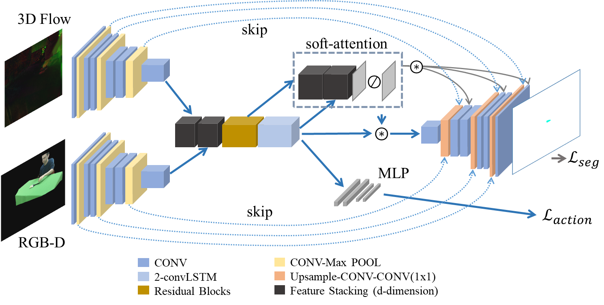
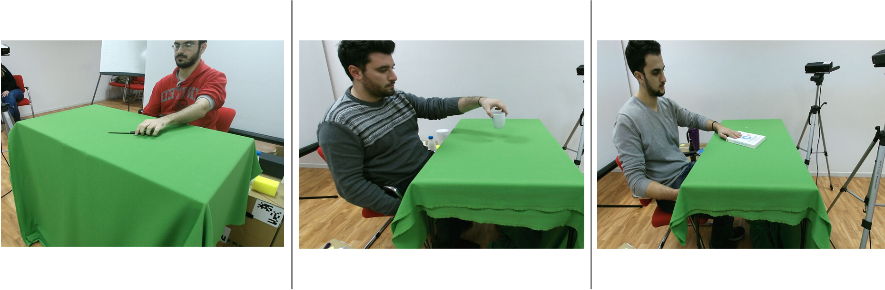
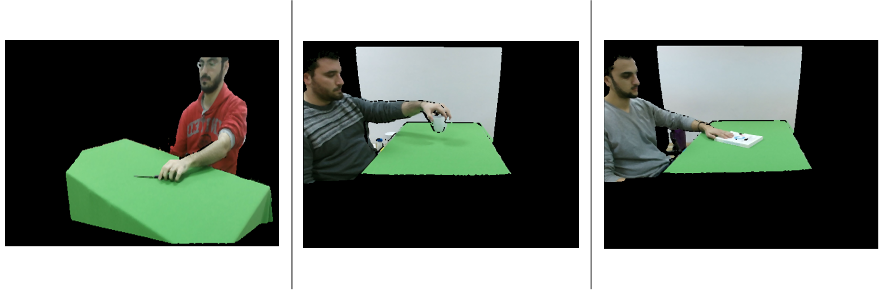
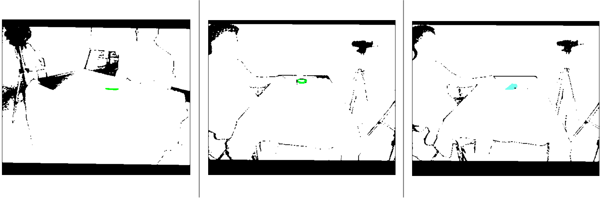
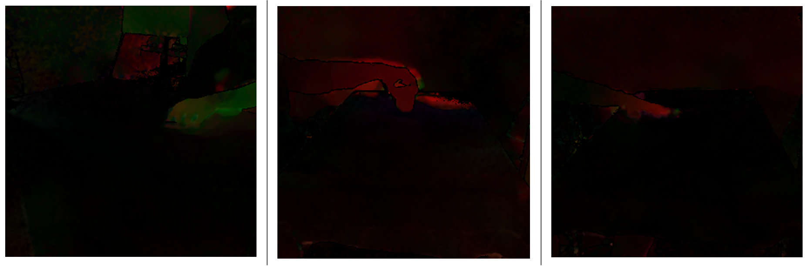

# A Deep Learning Approach To Oject Affordance Segmentation
Code and samples of the ICASSP "A Deep Learning Approach To Oject Affordance Segmentation" paper are provided in this repo. 

## Model Overview

## Prerequisites
The following are the minimum requirements to replicate the paper experiments:
- Python 3.7
- PyTorch 1.0.1
- CUDA 9.0
- Visdom (follow the steps [here](https://github.com/facebookresearch/visdom))

## SOR3D-AFF samples

RGB - original resolution (1920x1080)

RGB - aligned with depth maps (512x424)

Segmentation masks - Last frame only (512x424)

3D optical flow - after preprocessing (300x300)

